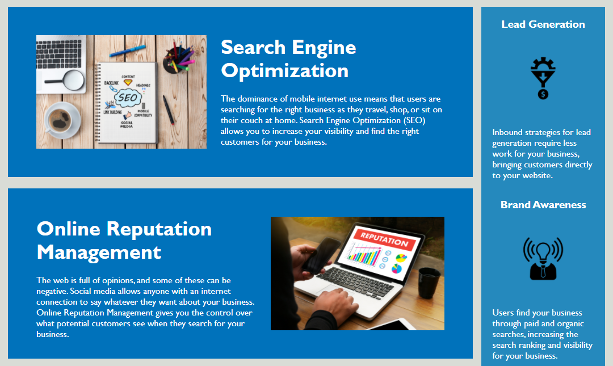

# Homework 1: Horiseon Homepage Accessibility Improvements and CSS Refactor

## Project Overview
Using accessibility criteria, developer worked to update on index.html to semantic tags and create descriptive alt tags for images. In addition, developer worked to consolidate existing selectors in style.css to account for any changes to HTML elements and simplified logical flow and added comments for additional context when next updates are required.

## Live Application
https://captain63.github.io/homework1-horiseon-homepage/

## Screenshot of Application

